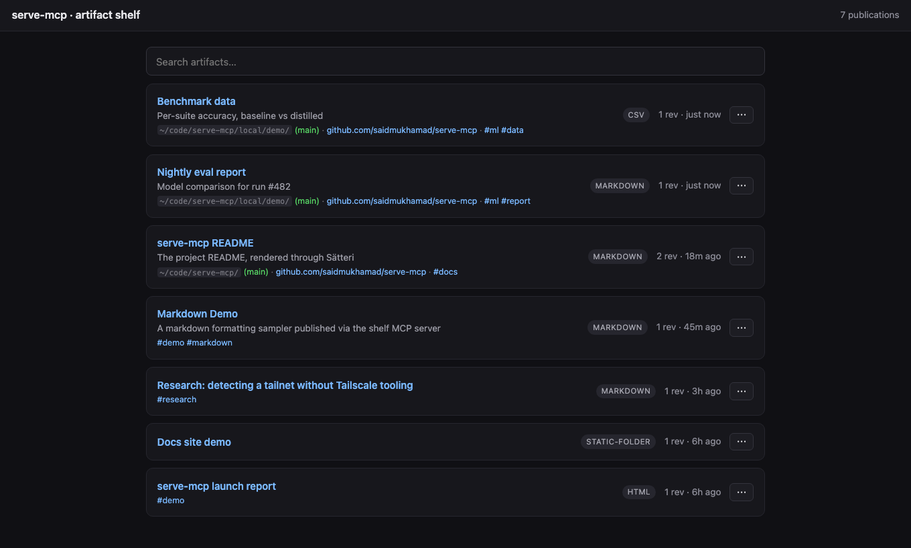
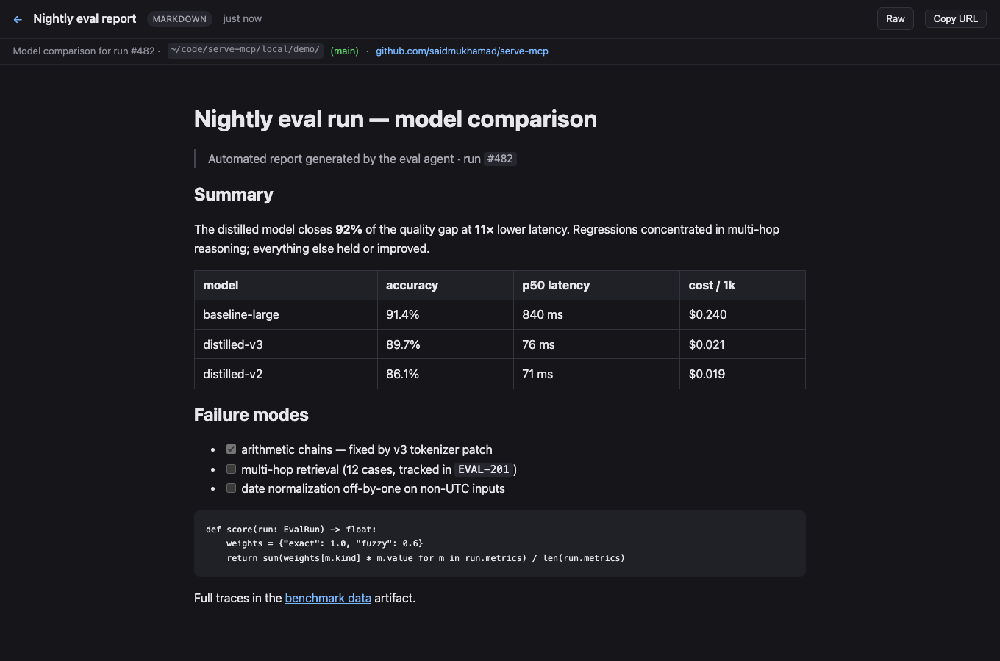
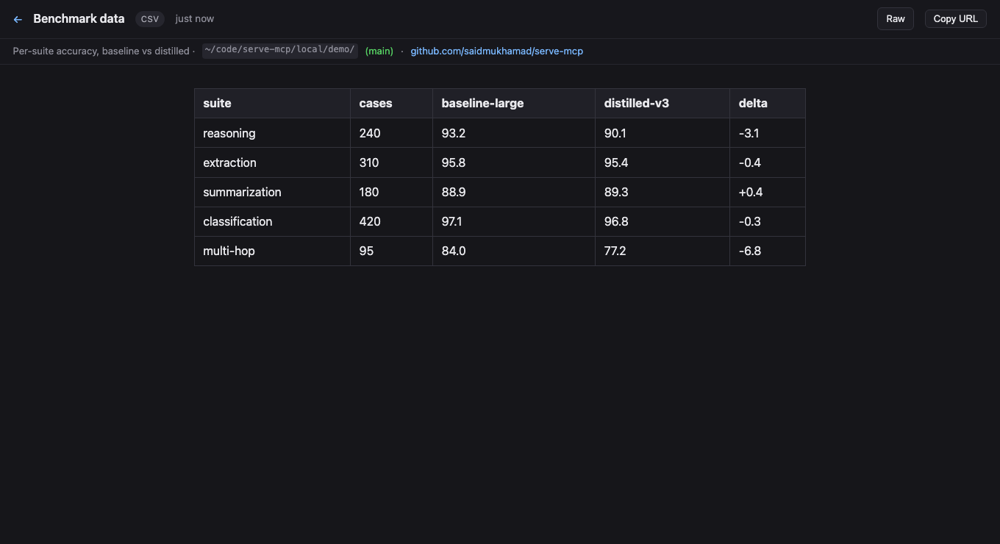
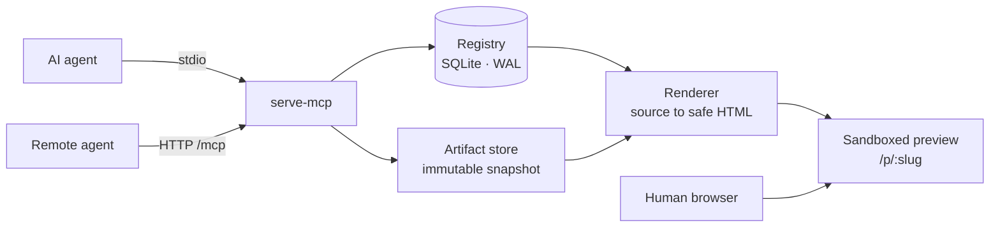
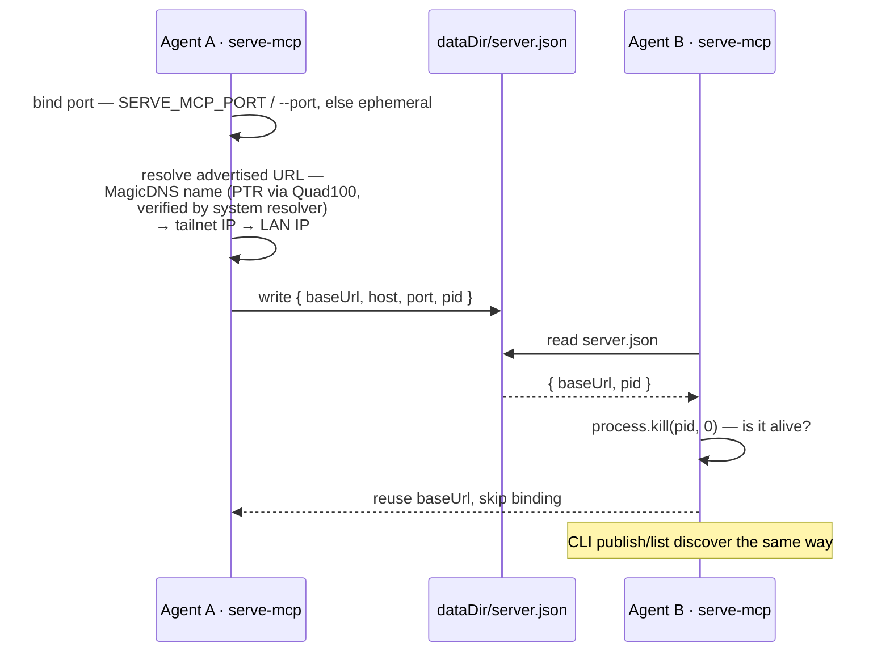

# serve-mcp

A local, MCP-controlled **artifact shelf**. Your AI agents publish the HTML, Markdown, folders, CSV, and JSON they generate; you get stable, safely-rendered browser URLs to look at them. Built for a machine running several agents at once: each agent gets its own MCP process, and they all publish to one shared shelf.



| Markdown report, rendered | CSV as a table |
| --- | --- |
|  |  |

## Quickstart

```bash
npm install -g serve-mcp
```

Add it to Claude Code (it speaks MCP on stdio **and** serves the HTTP shelf):

```bash
claude mcp add serve-mcp -- npx -y serve-mcp mcp
```

That's it. Ask an agent to publish something and open the URL it returns.

## How it works



**MCP** is the control plane (`artifact_publish`, `artifact_list`, resources). **HTTP** is the human preview plane (gallery, `/p/:slug`, sandboxed previews). The **registry** is a SQLite database mapping stable publication slots to immutable artifact revisions. The **store** snapshots every source so nothing is ever served live from your workspace.

## The two tools

### `artifact_publish`

```jsonc
{
  "source": { "type": "path", "path": "./report.md" },   // or content / folder
  "title": "Training run explanation",
  "slug": "training-run-explanation",                     // stable /p/<slug>; generated if omitted
  "updateExisting": true,                                 // add a revision; false = conflict on an existing slug
  "tags": ["ml", "report"],
  "renderer": { "options": { "allowScripts": false } }    // scripts stay off unless asked
}
```

Returns the preview URL, a raw URL, an MCP `resource_link`, and structured `artifact`/`publication` objects. Publications are stable slots; every publish is an immutable revision at `/p/:slug/r/:artifactId`.

### `artifact_list`

Filter by `query`, `tags`, `kind`; paginate with `cursor`; order by `createdAt | updatedAt | title`.

### Resources

Only `registry://publications` (JSON list of everything on the shelf) appears in `resources/list`, so host UIs stay clean no matter how many publications exist. Two more resolve when read directly (tool results link to them): `publication://<slug>` (compact JSON) and `artifact://<id>` (raw source of a revision).

## Multi-agent port discovery

The hard part: N agents, one shelf, no coordination. The first `serve-mcp` to start binds a port and records its reachable URL; everyone else finds that record and publishes into the running shelf instead of starting their own.



Advertised-URL resolution matters when you bind `0.0.0.0` for LAN/Tailscale access, since that isn't a linkable address. Detection is pure `os.networkInterfaces()` plus standard DNS — no Tailscale CLI or API. `SERVE_MCP_BASE_URL` overrides all of it.

## Rendering & safety

Sources are **snapshotted** into the store (`~/.local/share/serve-mcp`), so nothing is served from your workspace and revisions never change. Markdown/MDX renders through [Sätteri](https://satteri.bruits.org) (GFM, frontmatter); JSON pretty-prints; CSV becomes a table; folders serve as static sites.

Every HTML, Markdown, and SVG preview is served inside a sandboxed iframe with `Content-Security-Policy: script-src 'none'` — agent-generated content **cannot run scripts, phone home, or touch cookies**. Scripts are an explicit per-artifact opt-in (`renderer.options.allowScripts: true`), which loosens the sandbox to `allow-scripts` for that one artifact.

The server binds `127.0.0.1` unless you opt into `0.0.0.0`, and there is no auth — only expose it to networks you trust (a Tailscale tailnet qualifies; the open internet does not). Restrict path publishing with `SERVE_MCP_ALLOWED_ROOTS=/path/a:/path/b`.

### Folder navigation

Folders behave like a classic file server: each directory serves its own `index.html` / `index.md` / `README.md` (or pass `entrypoint`), `dir` redirects to `dir/` so relative and `../` links resolve, and directories without an index get a browsable listing with a `../` entry. In-folder Markdown/CSV/JSON render on the fly, and any file is downloadable with `?raw`.

### Provenance capture

Every publish records where it came from — source directory plus git branch, remote, and commit — read straight from `.git` files (no `git` subprocess, works even without git installed). This shows on the gallery cards and the preview subbar.

## HTTP routes

```txt
GET    /                         gallery (search, pinned, recent)
GET    /p/:slug                  latest revision, rendered
GET    /p/:slug/r/:artifactId    a specific revision
GET    /raw/:artifactId          original source
GET    /meta/:artifactId         artifact metadata JSON
GET    /api/publications         JSON list (query, cursor, limit)
DELETE /api/publications/:slug   remove a publication and all its revisions
```

## Tailscale / LAN access

To reach the shelf from other machines, bind all interfaces:

```bash
serve-mcp serve --host 0.0.0.0 --port 7331
```

Advertised URLs then pick the best reachable name automatically: MagicDNS name (learned via reverse DNS through Quad100 and verified with the system resolver, so it's only used when peers can actually resolve it) → Tailscale IP (`100.64.0.0/10`) → first LAN address. Tailnet detection needs no Tailscale tooling — it keys off the interface's CGNAT address and Tailscale's ULA prefix.

## MCP over HTTP (experimental)

The shelf also speaks MCP at `<baseUrl>/mcp` (Streamable HTTP transport, stateless). Combined with `--host 0.0.0.0`, agents on *other* machines can use this shelf directly:

```bash
# on machine B, pointing at machine A's shelf over the tailnet
claude mcp add shelf-a --transport http http://100.x.y.z:7331/mcp
```

Run a shelf on each machine and point them at each other for bidirectional publishing. Caveat: `path`/`folder` sources are read from the filesystem of the machine *running* the shelf, so remote publishers should use `content` sources.

## CLI

```bash
serve-mcp serve                                  # HTTP shelf only
serve-mcp publish ./report.md --title "Report"   # publish without an agent
serve-mcp list                                   # (also discovers a running shelf)
```

## Config

All optional:

```txt
SERVE_MCP_HOST           bind host, default 127.0.0.1 (0.0.0.0 for LAN/Tailscale)
SERVE_MCP_PORT           fixed port; unset = ephemeral + discovery via server.json
SERVE_MCP_BASE_URL       advertised-URL override (e.g. a MagicDNS name)
SERVE_MCP_DATA_DIR       default ~/.local/share/serve-mcp
SERVE_MCP_ALLOWED_ROOTS  colon-separated roots for path/folder publishing (default: anywhere readable)
```

`--port` and `--host` flags on `serve` / `mcp` override the environment.

## Development

```bash
npm install
npm test          # typecheck + node:test — core, http, mcp round-trip
npm start         # HTTP server
npm run build     # tsc -> dist/
```

Written in TypeScript; dev and tests run `.ts` directly via Node's native type stripping. Requires **Node ≥ 22.18** (type stripping + built-in `node:sqlite`).

## Non-goals

Not a CDN, not a deploy platform, not a filesystem browser, not a CMS. It does one thing: **publish generated artifacts → render safely → remember them → list them.**

MIT.
